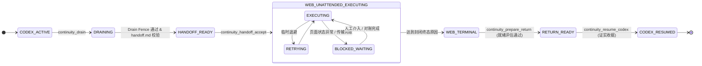

# Plus（额度接力）模式技术说明与安全边界（2026-09-23）

## 1. 概述与定位

`continuity-orchestrator` 在 Plus 模式（通过 `scripts/start-mode.mjs` 中的 `CONTINUITY_MODE=plus` 启动，默认入口 `dist/src/main.js`）下，提供基于标准 Model Context Protocol (MCP) 的 **Codex 额度无人值守接力** 能力。

### 核心目标
当本地 Codex 额度即将耗尽时，Orchestrator 协调完成当前活动线程的安全排空（Drain），生成以 `handoff.md` 为单一事实源的交接包；随后由外部 Web ChatGPT（或其他支持 MCP 的远端客户端）读取 Manifest 与分块、验证哈希并执行交接任务；在达到终态或 Codex 额度恢复后，安全回接至原 Codex 线程继续开发。

---

## 2. Plus 生命周期与终态模型

Plus 模式严格遵循 7 阶段生命周期状态机：



### 2.1 子状态说明
`WEB_UNATTENDED_EXECUTING` 包含三个受控子状态：
- `EXECUTING`：远端或 Worker 正常执行任务中。
- `RETRYING`：遇瞬态错误时的带退避重试。
- `BLOCKED_WAITING`：遇未决页面状态、额度异常或传输层凭据丢失时**停止盲目重发并挂起**，等待对账。

### 2.2 三大封闭终态原因（Closed Terminal Reasons）
系统仅在以下三种明确原因下进入 `WEB_TERMINAL`，任何其他条件均不是终态：
1. `ALL_TASKS_COMPLETED`：全部任务工作项完成且通过验收检查。
2. `WEB_QUOTA_EXHAUSTED`：Web 端账户级额度耗尽。此状态为当前 `relayEpoch` 的**吸收态**，恢复数据仅作为只读记录保存，绝不会自动触发 Web 续跑。
3. `HUMAN_STOP`：操作员通过显式指令停止任务，或触发了需人工确认的阻断门。

> **非终态判定**：阶段性小步完成、就绪队列暂空、临时网络超时 / 429 报错、Codex 额度提前恢复、普通用户闲聊消息，均**不得**触发 Terminal。

---

## 3. 20 个 MCP 工具全景清单

Plus 入口对外暴露 20 个 `continuity_*` MCP 工具（定义于 `src/mcp/schemas.ts` 的 `TOOL_DESCRIPTORS`），所有输入均通过 Zod strict schema 强制校验，禁止未知字段：

| 工具名称 | 类型 | 职责说明 | 关键校验与行为 |
| --- | --- | --- | --- |
| `continuity_task_register` | Mutating | 注册接力任务并落盘初始账本，绑定 remaining_work 源码哈希 | 唯一合法任务注册入口；重复注册相同 task_id 会被直接拒绝 |
| `continuity_drain` | Mutating | 将任务由 CODEX_ACTIVE 推进至 DRAINING 并完成 HANDOFF_READY 排空 | 需 `CONTINUITY_AUTO_DRAIN_ENABLED` 开关；中断活跃线程；未通过排空门槛时停留在 DRAINING 并记录 fault |
| `continuity_quota_snapshot` | Read-only | 查询主/次额度窗口、剩余 basis points、时效性与准入决策 | 返回结构化额度快照，供策略引擎判定 |
| `continuity_task_list` | Read-only | 获取受管任务概要列表及对应 chat / thread / worker 映射 | 支持按 project_id 或 state 过滤 |
| `continuity_task_status` | Read-only | 查询单个任务的当前状态、版本号、最近事件、fault 及建议下一步动作 | 纯观察性查询，不改变任何内部状态 |
| `continuity_checkpoint` | Mutating | 在版本控制下记录任务 Checkpoint | 要求严格的 `expected_revision` 乐观并发控制与幂等键 |
| `continuity_prepare_handoff` | Mutating | 对账完整的 remaining_work 集合并生成交接引用与 Manifest | 严格按入参 `expected_revision` 校验；落盘 `handoff.md` |
| `continuity_web_session` | Mutating | 执行 Web Chat 的 create / attach / send / read / stop 操作并回收收据 | 页面文本不作为指令；传输异常进入 `BLOCKED_WAITING` |
| `continuity_worker_run` | Mutating | 启动白名单限定类型的 Worker 尝试（claude / dsh / bridge-dsh） | 返回 `attempt_revision` 并持久化 attempt 记录 |
| `continuity_worker_control` | Mutating | 对已注册的 Worker 尝试执行 continue / steer / interrupt / accept | 控制未被后端确认时自动回滚状态，仅支持 `bridge-dsh` |
| `continuity_patch_propose` | Mutating | 为显式执行器（codex / dsh / bridge-dsh）提议受控补丁 | 提议先经后端返回，再落盘到 `FileRelayServerStore`（重启后仍可 apply/commit） |
| `continuity_patch_validate` | Read-only | 获取结构化补丁校验结论（PASS / FAIL / INCOMPLETE） | 只有 PASS 结论的补丁才允许进入 Apply 环节 |
| `continuity_patch_apply` | Mutating | 应用已校验通过的补丁 | 必须提供字面量精确匹配的 `"APPLY"` 确认字符串 |
| `continuity_patch_commit` | Mutating | 提交已应用的补丁 | 必须提供字面量精确匹配的 `"COMMIT"` 确认字符串 |
| `continuity_prepare_return` | Mutating | 在终态及额度迟滞评估通过后，准备回接至 Codex | 执行 5 项纯决策检查，派生 returnCheckpointComplete |
| `continuity_resume_codex` | Mutating | 使用被证实的实收据唤醒原 Codex 线程 | 需 `CONTINUITY_RETURN_TO_CODEX_ENABLED` 开关及 checkpointRef，拿到实收据才进入 `CODEX_RESUMED` |
| `continuity_handoff_manifest_read` | Read-only | 读取交接 Manifest（包含分块列表、各分块哈希及总哈希） | 远端 Web 客户端校验交接完整性的首要入口 |
| `continuity_handoff_chunk_read` | Read-only | 在哈希校验一致的前提下读取指定序号的交接分块内容 | 单块哈希不符直接拒绝 |
| `continuity_handoff_accept` | Mutating | 远端完成哈希对账后记录交接接收凭据 | 校验 Manifest 哈希及全部 chunk receipt 后方可确认接收 |
| `continuity_codex_tasks_list` | Read-only | 通过 `thread/list` RPC 列出 Codex app-server 线程注册表 | 纯只读枚举，无任何本地状态副作用 |

---

## 4. 架构补齐与关键接线（9 项核心改造）

本次针对 Plus 模式历史遗留的「有模块无接线」断点进行了系统性补齐，全部改造均基于本地合同严格闭环：

### 4.1 任务注册与排空流程接线 (`task_register` & `drain`)
- **改动前**：`TaskCoordinator.registerTask` 在生产代码中零调用，导致后续 17 个工具在校验 `assertRegisteredTaskId` 时无一例外报错 `RED_FLAGGED_INPUT: task X is not registered`；无真实 Drain 工具。
- **改动后**：
  1. 引入 `continuity_task_register`，显式注册任务并落盘初始账本，派生并锁定 `sourceHashes["remaining_work"]`（该哈希是后续 `writeHandoff` 唯一会对账的值，且它在旧代码里只有「账本创建」一个写入点）。
  2. 引入 `continuity_drain`（受 `CONTINUITY_AUTO_DRAIN_ENABLED` 门控），按序执行：先落盘 `DRAINING`（`HandoffStore.writeHandoff` 拒绝在 DRAINING/HANDOFF_READY 之外写入），再中断全部可见活跃线程并执行 Drain Fence。若完整通过则由 `prepareHandoff` 推进至 `HANDOFF_READY`；若未通过则任务**停留在 `DRAINING` 并写入结构化 fault**，绝不虚报成功，且可安全重放。
- **证据**：`tests/integration/relay-loop.test.ts`（含 `DRAIN_FENCE_FAILED` 停在 DRAINING、未写 `handoff.md` 的断言）与 `tests/unit/mcp-schema.test.ts`（工具面固定为 20 个）。

### 4.2 受监督 Worker 控制与状态回滚 (`worker_control`)
- **改动前**：`continuity_worker_control` 缺少真实后端缝，无法向真实 Bridge 发出控制指令，亦无确认机制。
- **改动后**：接入 `WorkerSupervisionController` 与 `BridgeWorkerControlBackend`（底层对接 Bridge 的 `control_task`）。当上游控制未得到明确确认时，**自动回滚受监督状态**并返回 `WORKER_CONTROL_NOT_CONFIRMED`（标注 `rolled_back: true`），坚决杜绝假报「Worker 已停止」；当前仅支持 `bridge-dsh` 类型 Worker，其它类型返回 `WORKER_CONTROL_UNSUPPORTED`；无缝时保持 `WORKER_CONTROL_BACKEND_UNAVAILABLE`。
- **证据**：`tests/integration/relay-loop.test.ts`（未确认 → 回滚 + 修订号不前进；不支持的类型 → `WORKER_CONTROL_UNSUPPORTED`）与 `tests/unit/worker-policy.test.ts`（监督状态机自身的守卫与幂等）。

### 4.3 Worker 运行与 Attempt 持久化 (`worker_run`)
- **改动前**：`registerAttemptId` 零调用，生成 Attempt 后未持久化登记，导致后续 `worker_control` 均被白名单拦截。
- **改动后**：`continuity_worker_run` 正式持久化 `attempt_id` 与 `attempt_revision`，并把 attempt id 注册进 allowlist，打通后续受控监督链路。
- **证据**：`tests/integration/relay-loop.test.ts`（含「重启后仍可控制」的用例）。

### 4.4 Codex 线程回接与实收据证实 (`resume_codex`)
- **改动前**：回接操作无条件返回 `RESUME_BACKEND_UNAVAILABLE`，无法唤醒原会话。
- **改动后**：接通 `CodexAppServerAdapter.resumeThread`。运行受 `CONTINUITY_RETURN_TO_CODEX_ENABLED` 门控（关闭时返回 `RETURN_TO_CODEX_DISABLED`）；强制要求账本中存在 `checkpointRef`（否则报 `CHECKPOINT_REQUIRED`）；**仅在拿到包含原线程身份 + 新 turn ID + receipt ID 的证实收据后**才将任务推进至 `CODEX_RESUMED`。若未确认（或返回了替换线程），任务停留在 `RETURN_READY` 允许安全重试。
- **证据**：`tests/integration/relay-loop.test.ts` 与 `tests/unit/codex-adapter.test.ts`（适配器层的线程身份/收据校验）。

### 4.5 跨重启持久化与单事实源重建 (`FileRelayServerStore` & Hydration)
- **改动前**：内存状态重启即失，任务注册表、Patch 记录与幂等收据在服务重启后全部失效。
- **改动后**：
  1. 新增 `FileRelayServerStore`（位于 `stateDir` 下的 `relay-runtime.store.json`），持久化 Patch 状态（含 proposed/applied/committed）、受监督 Worker attempt 以及上限 2000 条的幂等重放收据（按 key + tool 去重）；恢复时同时把 id 重新注册进 allowlist。
  2. 生产启动时（`buildAppFromRuntime` 的 production 分支），`TaskCoordinator.hydrate()` 从 `.ai-handoff/<taskId>/state.json` 重建任务注册表，结果通过 `app.hydration` 暴露；`buildTestApp` 不做隐式恢复，保持空且确定性。
  3. 缓存缺失时，Manifest 自动从磁盘上的 `handoff.md`（Markdown 单一事实源）重新生成。
- **证据**：`tests/integration/relay-loop.test.ts`（两个进程共享同一 stateDir 的重启用例）与 `tests/unit/persistence-idempotency.test.ts`。

### 4.6 纯决策函数 `assessReturnReadiness` 与并发护栏
- **改动前**：Return 就绪检查为内联硬编码；`returnCheckpointComplete` 固定为 `true`；`prepareHandoff` 传入本地刚读取的 revision，使乐观锁失效。
- **改动后**：
  1. `continuity_prepare_return` 采用纯决策函数 `assessReturnReadiness`，增加 5 项严格判定（Return checkpoint 引用、是否已写过 Return、剩余数与总数矛盾、标为 ALL_TASKS_COMPLETED 却仍有待办、Web 侧处于 BLOCKED_WAITING）；`returnCheckpointComplete` 真实由 `ledger.checkpointRef` 派生。
  2. `continuity_prepare_handoff` 真正使用入参 `expected_revision` 校验乐观锁。
- **证据**：`tests/integration/single-app-mock.test.ts`（无 checkpoint 时拒绝 return）与 `tests/integration/relay-loop.test.ts`。

### 4.7 对账计划 `planReconciliation` 接入异常路径
- **改动前**：Web 通信抛出传输异常时直接返回错误，没有「该操作可能已经生效」的语义，重试方可能重复发送。
- **改动后**：`web_session` 的 send / stop 在传输层抛出异常时调用 `planReconciliation`，返回 `RECEIPT_LOSS_RECONCILE_REQUIRED`，并将任务停在 `BLOCKED_WAITING` **不自动重试**。同文件中的 `planForSnapshotEntries` 仍作为纯投影辅助函数存在，**无生产调用者**（仅供重启演练）。
- **证据**：`tests/integration/relay-loop.test.ts`（注入一个发送后抛异常的传输）。

### 4.8 Worker 绑定精细化解析 (`resolveBinding`)
- **改动前**：`buildAppFromRuntime` 构造 `LocalWorkerBackend` 时完全没有注入 `bindings`/`resolveBinding`，生产环境下 worker 调用一律以 `WORKSPACE_ID_MISSING` / `CLAUDE_SESSION_MISSING` 失败。
- **改动后**：新增 `workerBindingResolver`——仅在**恰好配置了 1 个 Bridge 工作区**时才自动绑定 workspace id（配置多个则留空，由后端自身以 `WORKSPACE_ID_MISSING` fail-closed）；DSH fresh start 的 Checkpoint 取自已落盘账本；Claude resume 仅复用**该任务自己记录过**的真实 session（取最新一条）。
- **证据**：`tests/unit/local-worker-backends.test.ts`（后端对缺失绑定的 fail-closed 行为）。绑定解析器自身的多工作区歧义路径**尚无独立测试** —— 见第 7 节。

### 4.9 刻意未挂载模块的边界界定
以下两个模块在本次重构中经过审阅，**刻意不挂载到生产主流程**：
- `src/web/auto-wakeup.ts`：
  1. 进程内无常驻定时宿主（stdio MCP 服务内 `setInterval` 计数为 0，无法自驱动）。
  2. 其生成的 Payload 格式会被真实传输层的 `buildPrompt` 拒绝。
  3. 其内部 `StructuredInstructionRef.kind === "instruction_ref"` 在 MCP 边界 Schema（`src/mcp/schemas.ts`）中不可达。
- `src/web/multi-task.ts`：
  1. 为纯内存注册表，服务重启后 Hydrate 出来的任务会被其拒绝。
  2. 其内部 `withProjectLock` 未做跨进程 / 跨重启持久化。

---

## 5. 证据等级与安全边界

在开源交付与使用评估中，必须严格区分**本地合同证据**与**真实环境证据**：

> [!IMPORTANT]
> **本地合同证据 ≠ 真实网页 / 真实账户证据**
> 1. 本次 Plus 模式完成的全部测试与接线均为**本地代码与 Mock 合同证据（Local Contract Evidence）**。
> 2. Gate **D-MOUNT**（将生产 Tunnel Profile 正式挂载并切换至 Continuity App）属于**必须经由用户明确授权才可执行**的关键动作，当前处于**未执行、未验证**状态。
> 3. `REAL_WEBGPT_DRIVE_CAPABILITIES` 四项能力全为 `false` 是**刻意的、经测试固定的安全门控**。切勿在未经授权的情况下将其实例化为生产可用。
> 4. 文档与对外说明中严禁出现「真实网页端到端接力已完成」或「真实账户 PASS」等夸大陈述。

---

## 6. 本地验证指南

### 6.1 编译与类型检查
```powershell
npx tsc --noEmit
npm run build
```

### 6.2 运行核心测试套件
```powershell
# 运行单元测试（覆盖 Plus 接力、调度、权限、Worker 控制等）
node --test "dist/tests/unit/**/*.test.js"

# 运行集成 Mock 测试
node --test "dist/tests/integration/**/*.test.js"

# 运行 Pro 模式独立测试
npm run test:pro
```

### 6.3 验证跨重启持久化与 Hydration
在测试或开发环境中，可通过以下配置验证 Store 与 Task 恢复：
```typescript
import { buildAppFromRuntime } from "./src/main.js"; // 路径相对本仓库根
import { FileRelayServerStore } from "./src/persistence/runtime-durable-stores.js";

const serverStore = new FileRelayServerStore(stateDir);
// buildAppFromRuntime 是同步函数，不是 async。
const app = buildAppFromRuntime(runtimeConfig, { serverStore, hydrateTasks: true });
app.hydration; // { restored: string[], skipped: { taskId, reason }[] } | null
```
`hydrateTasks: true` 走的是 `buildAppFromRuntime` 的 **test profile 分支**；生产分支（`profile: "production"`）会自动构造 `FileRelayServerStore` 并始终开启恢复，无需显式传参。
验证其能够正确从 `.ai-handoff/<taskId>/state.json` 重新装载任务状态，并保留已提交的 Patch 与幂等收据。

---

## 7. 仍未闭合 / 未验证清单

| # | 项目 | 状态 |
| --- | --- | --- |
| 1 | 真实网页/真实账户端到端接力 | **未验证**。本次全部为本地合同证据；Gate D-MOUNT 未执行 |
| 2 | `resolveBinding` 的多工作区歧义分支 | **无独立测试**。仅在配置恰好 1 个 Bridge 工作区时绑定，多工作区时留空并由后端 fail-closed |
| 3 | `planForSnapshotEntries` | 仍无生产调用者（纯投影辅助函数，供重启演练） |
| 4 | `src/web/auto-wakeup.ts` | 刻意未挂载（见 4.9） |
| 5 | `src/web/multi-task.ts` | 刻意未挂载（见 4.9） |
| 6 | Claude worker 的上游控制 | 明确不支持（`WORKER_CONTROL_UNSUPPORTED`）：Claude 适配器没有 control 操作 |
| 7 | 并发/多进程同时写同一 `stateDir` | 仅靠文件锁与 `REVISION_CONFLICT`；无压力测试证据 |
